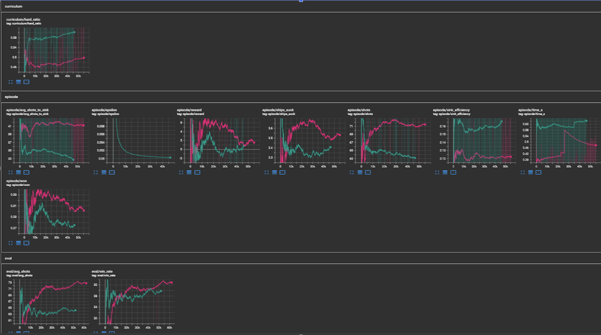
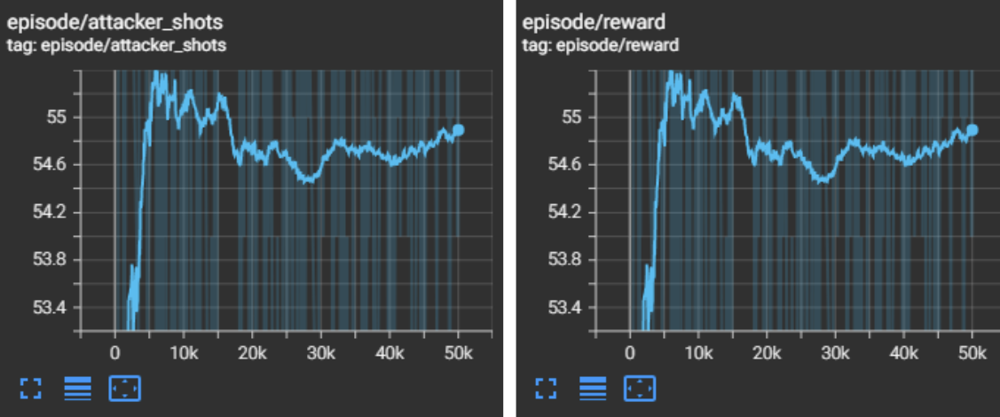
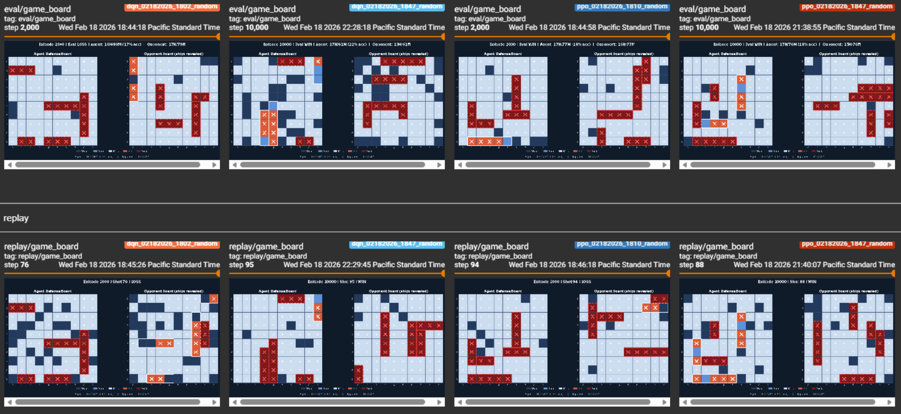
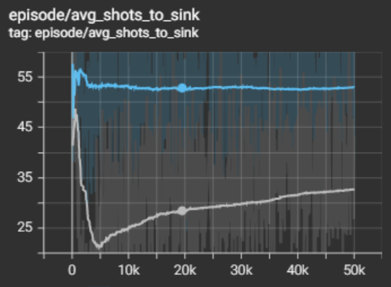
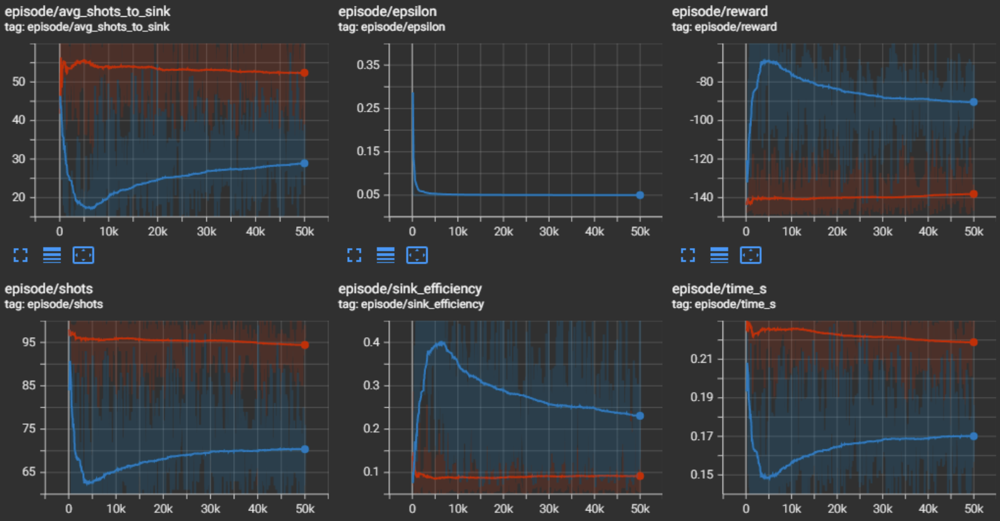

# Final Report

## Video

*Embed your project video here. Example for YouTube:*

```html
<iframe width="560" height="315" src="https://www.youtube.com/embed/B2igygD3VVk"
  title="NavalNet Demo" frameborder="0" allowfullscreen></iframe>
```

---

## Project Summary

NavalNet is a reinforcement learning project that trains AI agents to play the classic board game Battleship. The game is played on a 10×10 grid where each player places five ships of varying lengths (sizes 2, 3, 3, 4, and 5) and then takes turns shooting at coordinates on the opponent's hidden board. The goal is to sink all five of the opponent's ships before they sink yours.

Battleship is a deceptively rich environment for machine learning research. The core difficulty is **partial observability**: the agent can only see the results of its own shots (hits and misses) but never the positions of the enemy's ships. This means the agent must reason under uncertainty, balancing *exploration* (scanning unknown cells) with *exploitation* (following up on known hits). The game also requires strategic **ship placement**, as a well-placed fleet forces the opponent to spend more shots finding ships. Together, these two subproblems of where to shoot, and where to place your ships, make Battleship a compelling benchmark for evaluating the action efficiency, exploration behavior, and strategy optimization of RL algorithms.

Beyond partial observability, Battleship presents the challenge of a **large, discrete action space** (100 possible shot coordinates) with highly **sparse rewards**: in a 100-shot game, the agent might only observe a handful of meaningful hits, while every other step is noise. Classical approaches such as the Hunt/Target strategy (shoot randomly in a checkerboard pattern until a hit, then systematically sink the ship) achieve roughly 53 average shots per game. We asked whether a learned RL policy could discover similar or superior strategies purely from trial and error.

The project explores two major algorithm families: **Deep Q-Networks (DQN)**, a value-based off-policy method that learns expected cumulative rewards (Q-values) for each action in a given state, and **Proximal Policy Optimization (PPO)**, an on-policy policy-gradient method that learns a probability distribution over actions. We built a full Battleship environment from scratch, instrumented it with TensorBoard logging, developed an interactive human evaluation UI, and ran extensive experiments to compare the two approaches.

---

## Approach

### Environment

We implemented a fully custom Battleship environment in Python, following an OpenAI Gym-style interface. The environment supports two players and handles all game rules: ship placement validation, shot resolution (hit/miss/sink), turn management, and win detection. The environment can be configured with different opponents and reward functions at runtime, making it easy to swap in algorithmic baselines (Random, Hunt/Target, Curriculum) without changing training code.

Initially, we trained our agents against a **gated curriculum opponent** that starts as the random bot an ramps behavior towards the Hunt/Target bot as the agent's rolling win rate passes a threshold (40%). This allows the agent to accumulate positive experiences early and only face harder opponents once it has learned basic shot efficiency. However the results were sub-optimal, the more difficult hunt/target opponent would win too quickly, not giving the agent enough info to learn from. It could finish the game in 56 shots compared to 90 from the initial agent. Reward punishments would drown out any useful information. Also, any decisions to increase opponent difficulty were mainly supported by the only wins against the easy random opponent


*TensorBoard results from curriculum training — performance plateaus and becomes unstable as the opponent difficulty ramps up.*

<video width="560" controls>
  <source src="imgs/cirriculum.mp4" type="video/mp4">
</video>

*Replay of an episode from curriculum training, showing the agent's shot pattern against the gated opponent.*

To address this, we switched to self-play in an **isolated environment**. This way we can focus solely on shot efficiency metrics. The agent would train its heads individually using **two training modes**:

- **Shooting mode**: The agent only trains the shooting head; ship placement is random, and the opponent's turn is disabled. This isolates shot efficiency from win/loss noise.
- **Placement mode**: The agent only trains the placement head, scored by how many shots a Hunt/Target attacker needs to sink all five ships (more shots = better placement).

<video width="560" controls>
  <source src="imgs/isolated_env.mp4" type="video/mp4">
</video>

*Replay from the isolated shooting environment — the agent fires without an opponent turn, allowing pure evaluation of shot strategy.*


*TensorBoard results from training the placement head — the agent learns to arrange ships so that a Hunt/Target attacker requires more shots to sink the fleet.*

We also experimented a lot with training duration, starting with 2K, moving upwards of 50K. Any more episodes didn't seem to give any useful data regarding the efficacy of the algorithm. We also ran into significant decay which will be further discussed later. 

### Observation Space

The earliest version of the agent received a single-channel 10×10 grid of integers (0 = unknown, 1 = miss, 2 = hit, 3 = sunk). This proved insufficient: the CNN had to discover through pure reward signal that integer value 2 means "shoot adjacent to this cell," a relationship that requires many thousands of episodes to infer from scratch, if at all.

We progressively expanded the observation to a **6-channel binary representation**, where each channel encodes a distinct, semantically meaningful aspect of the board state:

| Channel | Meaning |
|---------|---------|
| 0 | Unknown (unshot) cells |
| 1 | Missed cells |
| 2 | Unsunk hit cells (active targets) |
| 3 | Sunk hit cells |
| 4 | Unshot cells adjacent to unsunk hits — high-priority targets |
| 5 | Ship probability heatmap |

**Channel 4** was the most impactful addition. Instead of requiring the CNN to learn the spatial relationship "if (3,4) is a hit and (3,5) is unknown, then (3,5) is a good shot" through trial and error, this adjacency mask is pre-computed and injected directly as an explicit feature plane. The agent can immediately use it to prioritize follow-up shots without discovering the rule from scratch.

**Channel 5** adds a ship probability heatmap, computed by enumerating all valid placements of remaining (unsunk) ships across the board, counting how many placements pass through each unknown cell, and normalizing to [0, 1]. This heatmap naturally encodes the *checkerboard parity* heuristic (ships of length 2 or more cannot be on adjacent cells of the same parity), highlights cells that extend known hit lines, and updates dynamically as ships are sunk. The observation shape is `(6, 10, 10)`, verified to have heatmap values in `[0.29, 1.0]` at game start.

### Neural Network Architecture

**Shooting head (`DQNNetwork` / Actor-Critic policy for PPO):**

The shooting network takes the `(6, 10, 10)` observation and outputs Q-values (DQN) or logits (PPO) over the 100 possible shot coordinates:

```
Input: (6, 10, 10)
Conv2d(6 → 64, kernel=3, pad=1) + ReLU
Conv2d(64 → 64, kernel=3, pad=1) + ReLU
Conv2d(64 → 64, kernel=3, pad=1) + ReLU
Flatten → 6400
Linear(6400 → 256) + ReLU
Linear(256 → 256) + ReLU
Linear(256 → 100)     ← Q-values / logits over 100 cells
```

**Placement head (`PlacementDQNNetwork`):**

The placement network takes the agent's 10×10 board plus a one-hot ship index and outputs Q-values over 200 placement actions (row × col × orientation):

```
Input board: (1, 10, 10)
Conv2d(1 → 32, kernel=3, pad=1) + ReLU
Conv2d(32 → 64, kernel=3, pad=1) + ReLU
Flatten → 6400
Concat with ship one-hot (5-dim) → 6405
Linear(6405 → 256) + ReLU
Linear(256 → 256) + ReLU
Linear(256 → 200)     ← Q-values over 200 placement actions
```

Action masking is applied at inference time: Q-values for already-shot cells (shooting) or invalid placements (placement) are set to `-∞` before the argmax, guaranteeing only legal actions are selected.

### DQN Algorithm

DQN learns a state-action value function Q(s, a) using the Bellman equation:

$$Q(s, a) \leftarrow r + \gamma \max_{a'} Q_{\text{target}}(s', a')$$

The loss minimized is the mean squared error between the predicted Q-value and the Bellman target:

$$\mathcal{L}(\theta) = \mathbb{E}_{(s,a,r,s') \sim \mathcal{D}} \left[ \left( Q_\theta(s,a) - \left( r + \gamma \max_{a'} Q_{\bar\theta}(s',a') \right) \right)^2 \right]$$

where $$\mathcal{D}$$ is a replay buffer, and $$Q_{\bar\theta}$$ is a periodically-synced target network.

**Key DQN hyperparameters:**

| Parameter | Value |
|-----------|-------|
| Learning rate | 1e-4 (Adam) |
| Discount factor γ | 0.99 |
| Replay buffer size | 50,000 |
| Batch size | 64 |
| Target network update | every 500 steps |
| ε start | 1.0 (from scratch) / 0.3–0.4 (from weights) |
| ε end | 0.05–0.10 |
| ε decay | 0.99995 (per step) |
| Gradient clipping | 1.0 (max norm) |
| Buffer reset interval | every 5,000 episodes |


The placement head uses Monte Carlo targets: the episode return is computed at the end of the game and assigned to all placement transitions, rather than bootstrapping with a next-state value.

### PPO Algorithm

PPO is an on-policy policy gradient method that maximizes a clipped surrogate objective to prevent destructive policy updates:

$$\mathcal{L}^{CLIP}(\theta) = \mathbb{E}_t \left[ \min\left( r_t(\theta) \hat{A}_t,\ \text{clip}(r_t(\theta), 1-\varepsilon, 1+\varepsilon) \hat{A}_t \right) \right]$$

where $$r_t(\theta) = \pi_\theta(a_t | s_t) / \pi_{\theta_\text{old}}(a_t | s_t)$$ is the probability ratio and $$\hat{A}_t$$ is the generalized advantage estimate (GAE). An entropy bonus $$\mathcal{H}[\pi_\theta]$$ is added to encourage exploration.

**Key PPO hyperparameters:**

| Parameter | Value |
|-----------|-------|
| Entropy coefficient | 0.08 |
| Update epochs per rollout | 8 |
| Rollout steps | 20 |
| Clip range ε | 0.2 (default) |
| Value loss coefficient | 0.5 |

### Reward Function

Reward design was one of the most iterative aspects of the project. The fundamental challenge in Battleship is **reward sparsity**: in a 100-cell grid with only 17 ship cells (sizes 2 + 3 + 3 + 4 + 5), the vast majority of actions produce misses. A reward function that only signals at game end (win/lose) leaves the agent with almost no gradient to learn from during the ~80 miss steps that dominate each episode.

#### Full-Mode Rewards (Early Experiments)

Our initial reward function provided signals for every event type:

| Signal | Value |
|--------|-------|
| Win | +100.0 |
| Lose | −100.0 |
| Hit | +1.0 |
| Miss | −0.5 |
| Sink | +5.0 |
| Adjacent hit bonus | +0.3 |
| Efficient sink bonus | +2.0 × η |
| Per-turn penalty | −0.05 |

where the sink efficiency η for a given ship is defined as:

$$\eta = \frac{L}{S}$$

with $L$ = ship length (number of cells the ship occupies) and $S$ = the number of agent shots elapsed from the first hit on that ship to the sinking shot (inclusive). A perfect follow-up sequence where every shot after the first hit lands on the same ship gives $\eta = 1.0$; wandering away to miss other cells before finishing drives $\eta$ toward 0.

This formulation suffered from two problems. First, the large win/lose rewards ($\pm 100$) dominated the episode return and drowned out the sparser but more informative hit/sink signals. Q-value estimates were pulled toward modeling win probability rather than shot efficiency, which is the metric we actually care about. Second, when training against a curriculum opponent that could finish the game in ~56 shots (compared to the agent's ~90), the −100 loss penalty accumulated so frequently that negative reward signals overwhelmed any positive learning signal from successful hits.

#### Shooting-Mode Rewards (Final Design)

After switching to the isolated shooting environment, we redesigned the reward function to focus exclusively on shot efficiency. Win/lose, hit, sink, and adjacent-hit rewards were all zeroed out. The final reward at each time step $t$ is:

$$r_t = r_{\text{turn}} + r_{\text{outcome}}$$

where $r_{\text{turn}} = -0.15$ is a constant per-turn living penalty applied to every step, and $r_{\text{outcome}}$ depends on the shot result:

**On a miss:**

$$r_{\text{outcome}} = r_{\text{miss}} = -1.5$$

**On a hit that does not sink a ship:**

$$r_{\text{outcome}} = 0$$

**On a hit that sinks a ship of length $L$:**

$$r_{\text{outcome}} = \alpha \cdot \eta^2 - \beta \cdot \Delta$$

where:
- $\eta = L / S$ is the sink efficiency (as defined above)
- $\alpha = 12.0$ is the efficient sink coefficient
- $\beta = 0.1$ is the inter-sink gap penalty coefficient
- $\Delta$ is the number of shots fired since the last ship was sunk (reset to 0 after each sink)

The key design choice is **squaring the efficiency** ($\eta^2$ rather than $\eta$). This creates a nonlinear reward landscape that sharply distinguishes perfect follow-ups from sloppy ones. Consider a ship of length 3:

| Shots to sink ($S$) | Efficiency $\eta = 3/S$ | Linear reward $\alpha \cdot \eta$ | Squared reward $\alpha \cdot \eta^2$ |
|---------------------|-------------------------|-----------------------------------|--------------------------------------|
| 3 (perfect) | 1.00 | 12.0 | 12.0 |
| 4 | 0.75 | 9.0 | 6.75 |
| 5 | 0.60 | 7.2 | 4.32 |
| 6 | 0.50 | 6.0 | 3.00 |
| 10 | 0.30 | 3.6 | 1.08 |

Under linear scaling, sinking a length-3 ship in 6 shots still earns half the maximum reward. Under quadratic scaling, the same outcome earns only 25% of the maximum. This steeper dropoff creates a stronger gradient toward tight follow-up behavior and discourages the agent from wandering away from active hits.

The **inter-sink gap penalty** ($-\beta \cdot \Delta$) complements the efficiency reward by penalizing wasted shots between sinks. Even if the agent eventually sinks a ship efficiently, firing 20 exploratory misses before finding it is penalized. Together, these two terms encourage both *finding* ships quickly and *finishing* them once found.

The **per-turn penalty** ($r_{\text{turn}} = -0.15$) ensures the agent accumulates negative reward on every step regardless of outcome, creating pressure to end the game in as few total shots as possible. Combined with the miss penalty, a miss step costs the agent $-0.15 + (-1.5) = -1.65$ total, while a non-sinking hit costs only $-0.15$, providing clear signal that hits are preferable.

| Signal | Value |
|--------|-------|
| Per-turn living penalty | −0.15 |
| Miss penalty | −1.5 |
| Efficient sink reward | $+12.0 \cdot \eta^2$ |
| Inter-sink gap penalty | $-0.1 \cdot \Delta$ |

#### Placement-Mode Rewards

The placement head uses a fundamentally different reward structure. Rather than receiving step-by-step feedback, the agent places all five ships and then a Hunt/Target attacker simulates a full game against that placement. The reward is the total number of attacker shots required to sink all ships:

$$R_{\text{placement}} = N_{\text{attacker\;shots}}$$

A higher value means the attacker needed more shots, indicating a stronger defensive placement. This Monte Carlo-style reward is assigned retroactively to all five placement transitions in the episode, so each ship placement decision receives credit proportional to the overall fleet quality rather than its individual contribution. Typical Hunt/Target attackers need 50–65 shots against random placements; a well-trained placement head pushes this toward 65–70+.

---

## Evaluation

### Quantitative Results


*TensorBoard visualization of multiple training sessions running simultaneously, showing episode-level metrics across different configurations.*

After training, we evaluated all agents and human play over a common set of episodes using our interactive web-based evaluation tool. The primary metrics are average shots per episode (lower = better), average shots needed to sink each ship, and shot efficiency (ship size / shots used to sink it, as a percentage).

| Metric | Human (Michael) | Random | Hunt/Target | DQN |
|--------|----------------------|-----------------|----------------------|-----------------------------|
| Avg shots/episode | **48.2** | 95.6 | 53.4 | 60.9 |
| Avg shots to sink | 5.5 | 54.5 | 5.8 | 18.1 |
| Avg efficiency | 68.7% | 8.3% | **72.9%** | 39.9% |
| Avg reward | −26.1 | −140.5 | −31.6 | −64.7 |
| Best game (min shots) | 32 | 71 | 30 | 45 |
| Worst game (max shots) | 64 | 100 | 65 | 83 |


The DQN agent substantially outperforms the random baseline (60.9 vs 95.6 average shots) and demonstrates learned behavior (best game: 45 shots), but does not yet match the Hunt/Target algorithmic bot (53.4 shots) or human play (48.2 shots). The gap in average efficiency (39.9% vs 72.9%) reflects the DQN's occasional tendency to wander away from active hits rather than finishing a ship, a failure mode described further below.

### Training Curves and DQN Decay

TensorBoard logging revealed a consistent pattern across DQN runs: performance improves rapidly in the first ~5,000 episodes, then plateaus and gradually decays. This was observed in both full-game and isolated shooting-mode runs.


*Average total shots over the course of training — performance peaks early then gradually decays, a pattern consistent across multiple training runs.*

In the shooting-mode curriculum runs, the best DQN checkpoint (at episode 5,000) achieved approximately 28 average shots to sink all ships. After 50,000 episodes, performance had degraded back toward 55+ shots. The final model used for evaluation was therefore the **weights extracted at the peak (episode 5,000)**, rather than the end of training.

We identified two likely causes of this decay:

1. **Replay Buffer Homogenization**: As the replay buffer fills with on-policy experiences from one strategy, it loses diverse exploratory data. The agent overfits to a local policy and forgets edge cases that were captured earlier in training.
2. **Overestimation Bias**: Standard DQN overestimates Q-values, a bias that compounds over time, causing the agent to prefer actions that were once rewarded but are no longer optimal.

Attempted mitigations included periodic buffer resets (every 5,000 episodes), slower epsilon decay, and higher epsilon floors (ε_end = 0.10). While these helped slow the decay, they did not eliminate it. Proposed future solutions include Prioritized Experience Replay, Double DQN, and cyclic epsilon schedules.

### DQN vs. PPO Comparison


*Side-by-side comparison of DQN and PPO training curves in the isolated shooting environment.*

DQN consistently outperformed PPO across all experiments. The smoothed average shots-to-sink for the best DQN run was approximately 28.5 vs. 52.8 for the comparable PPO run at the same episode count.

We attribute this gap to several structural factors:

**Experience Replay vs. On-Policy Discard**: DQN's off-policy replay buffer retains rare successful hit sequences and reuses them for many updates. PPO discards all data after each policy update, losing the few positive experiences from early training when the agent rarely hit anything.

**Discrete Action Fit**: Battleship requires selecting one exact coordinate out of 100. DQN directly assigns a scalar Q-value to each cell and picks the maximum, which is perfect for the discrete nature of the game. PPO must maintain and update a 100-way probability distribution, which is slower to concentrate probability mass onto the correct cells.

**Forced Exploration vs. Entropy Collapse**: DQN's ε-greedy strategy mathematically guarantees board exploration (visiting random cells with probability ε). PPO relies on policy entropy; once PPO found a mediocre but safe strategy, its entropy collapsed and exploration essentially stopped, locking it into a suboptimal policy.

### Qualitative Behavior

Replays recorded via TensorBoard and the interactive game UI show that the DQN agent has learned recognizable Battleship strategies:

- **Hit following**: When the agent lands a hit, it reliably shoots adjacent cells in subsequent turns rather than returning to random search. This behavior was explicitly encouraged by Channel 4 (adjacency mask) and is clearly visible in game replays.
- **Imperfect chaining**: The agent sometimes abandons an active hit cluster to probe a different region of the board, returning to the first cluster only after a miss elsewhere. This reduces efficiency compared to the Hunt/Target bot, which always finishes the current target before moving on. We attempted to fix this by adding a "most recent hit adjacency" channel (biasing the agent toward the *latest* hit rather than *any* unsunk hit), but this change made performance worse rather than better, suggesting the signal introduced conflicting gradients.
- **Parity preference**: The heatmap channel (Channel 5) appears to induce mild checkerboard parity in the agent's search pattern, though this is less crisp than the algorithmic checkerboard search.

### Evaluation Tool

We built an interactive browser-based evaluation tool that allows a human player to play against the DQN agent or algorithmic bots (Random, Hunt/Target). The tool renders both the player's defense board and the attack board in real time, logs every shot and its result, and displays running statistics (shots, ships sunk, shot efficiency, reward). A separate "Eval" mode records either human player's or model's own statistics over multiple episodes to enable direct head-to-head comparison.

---

## Resources Used

**Papers and Algorithmic References:**

- Mnih et al. (2015), "Human-level control through deep reinforcement learning" (DQN, Nature) — core DQN algorithm and replay buffer design.
- Schulman et al. (2017), "Proximal Policy Optimization Algorithms" — PPO clipped objective and GAE.
- DataGenetics, "Battleship" (http://www.datagenetics.com/blog/december32011/) — analysis of optimal Battleship strategies including Hunt/Target and parity-based search; provided the theoretical baseline and motivation for the ship probability heatmap.

**Libraries and Tools:**

- PyTorch — neural network implementation, training loop, CUDA acceleration.
- NumPy — environment logic and array operations.
- TensorBoard — training visualization and game replay rendering.
- SLURM / UCI HPC3 — distributed job scheduling for 24-hour training runs.
- Python standard library (`collections.deque`, `random`, `pathlib`) — replay buffer implementation.

**AI Tool Usage:**

Claude (Anthropic) was used as a coding assistant throughout the project for: debugging environment logic and implementing architectural and design decisions. Any generated code was manually reviewed post generation. All structural, parameter, design, and high-level (non-syntax) details were chosen by team.

---

## Future Work

Several directions remain unexplored due to time constraints:

- **Double DQN**: Decoupling action selection from value estimation would reduce the overestimation bias identified as a likely cause of performance decay after episode 5,000.
- **Prioritized Experience Replay (PER)**: Sampling transitions weighted by their temporal-difference error would focus learning on rare, informative experiences (edge cases and efficient sinks) rather than the homogenized majority of the replay buffer.
- **Cyclic Epsilon Schedule**: Periodically resetting ε to a higher value after it decays could inject fresh exploratory data and counteract buffer homogenization without requiring a full training restart.
- **Dueling DQN**: Separating the value stream (how good is this board state?) from the advantage stream (how much better is this shot than average?) may produce more stable learning in the sparse-reward Battleship setting.
- **Evolutionary / Grid-Search Hyperparameter Optimization**: Reward weights (miss penalty, efficient sink bonus, per-turn penalty) were tuned manually through trial and error. A systematic grid search or evolutionary strategy would likely find better configurations.
- **Self-Play**: Training the agent against its own previous checkpoints (rather than fixed algorithmic opponents) is a natural next step toward discovering emergent strategies that go beyond what the Hunt/Target baseline can teach.

---

*NavalNet — Michael Ip, Dylan Tanaka, Wilson Soetomo   — CS 175, Spring 2026*